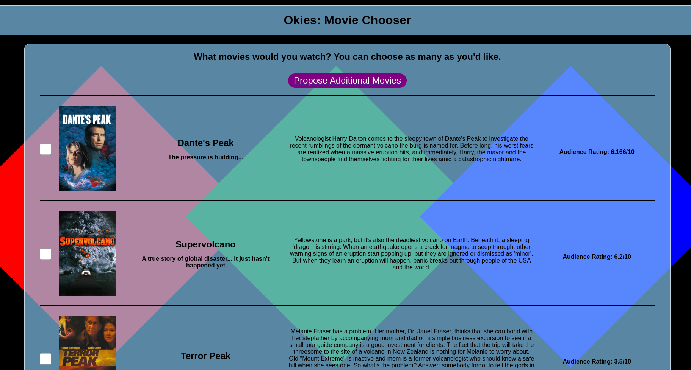
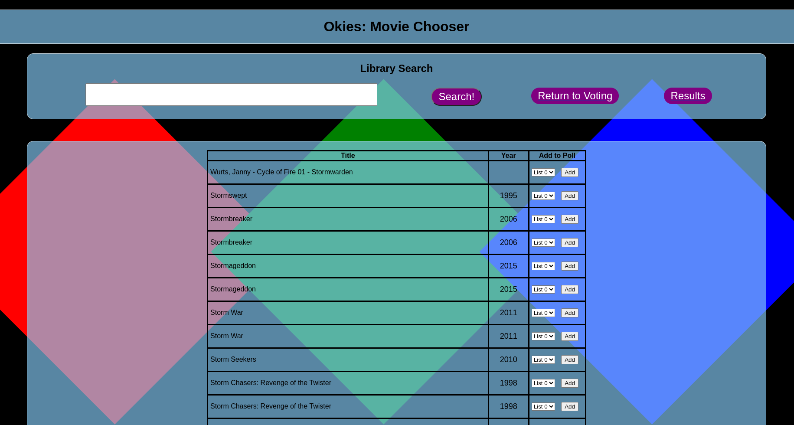
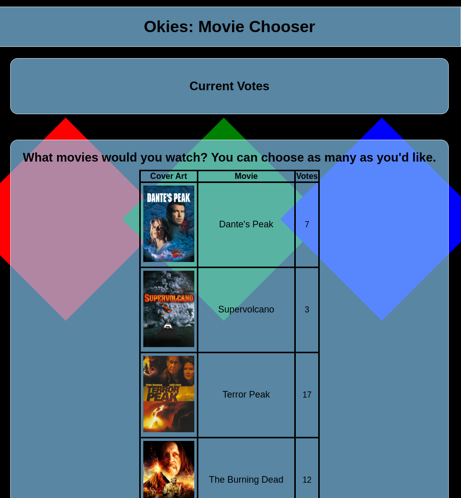

# Okies: Movie Chooser
A program to make it easier to pick movies to watch in a group. Make a list of the movies you're interested in watching, and then vote on which movies everyone is willing to watch.

## Screenshots

The search and add movies screen.

The results screen.  

## Installing

Setting up your own instance of Okies.

### Prereqs
- A current version of NodeJS installed
- NPM installed
- For docker installations: Docker and Docker Compose
- An instance of Jellyfin, an API Key, and a UserID (for grabbing metadata and cover art).

### Installing with docker compose (Recommended):
1. Clone the repository.
    > git clone https://git-site/this-repository
2. Open the folder in terminal, and install npm packages
    > npm i
3. Adjust the docker-compose.yml file as needed.
4. Run docker compose in the root folder of your copied repository.
    > docker compose up -d

### Installing without containerization:
1. Clone the repository.
    > git clone https://git-site/this-repository
2. Open the folder in terminal, and install npm packages
    > npm i
3. Run node to start the server in the root folder of your copied repository.
    > node ./index.js
4. Access the web app in your web browser. (http://localhost:3500/)

## Add your API Keys and Jellyfin UserID

1. Copy the default config.json.sample to config.json in the repository folder.
2. Add your API_Key, UserID, and jellyfinURL.
    - You can get an API key for your Jellyfin server from the admin dashboard API key settings page.
    - See Jellyfin documentation for additional information

### Jellyfin UserID 
Your UserID is the long UserID used by the Jellyfin API, not your username. If you don't know how to use the API to get this, you can have Okies dump the full userlist for you.

1. Add your API key and Server URL for Jellyfin to config.json

2. Manually run Okies by either executing "node index.js" OR running "docker compose up" without the -d (detached) flag.

3. Go to your Web browser and navigate to localhost:PORT/userID.

4. The server will dump all current userIDs from your jellyfin server in the server log.

5. Copy and paste the userID for the library that Okies should use for searches and metadata.

6. Press ctrl+c in the server terminal window to stop Okies

## Finish set-up through the Web Interface

1. Restart the server.
    - Recreate/create the container (docker compose up -d) 
    - or restart node if not using Docker

2. Access the web app in your web browser. (http://localhost:PORT/)

3. There will be no movies added by default. Click "Propose additional movies" or navigate to http://localhost:PORT/search.

4. Test the API by searching for something that you know is in your jellyfin library.

5. Add items to the default list
    1. Search for items from your library by name
    2. select list # from the dropdown (will be 0 since there is only one list in default configuration)
    3. click "Add" in the row with the movie you'd like to add.

6. When finished adding, you can vote at http://localhost:3500/

## Managing Polls

Polls can be managed at http://localhost:3500/manage. This page must be accessed by the direct link. Options here include:
- Remove items from lists - remove items from poll lists. WARNING: These also dumps all votes for deleted items.
- Save My Polls to Server - writes out current polls to save.json. If you are using the default configuration, this JSON will load the next time the server starts. Votes are also saved, but all API data is refreshed on restart.
- Add List - Write the prompt and press "Create new list" to create an additional survey list. Lists are for helpful for organizing when you may want to pick multiple rounds of movies, such as for a movie night.
- Remove list - This removes a list and all of its' associated items.
- Reset Votes - Lists and items are preserved, but the vote count is zeroed on all items.